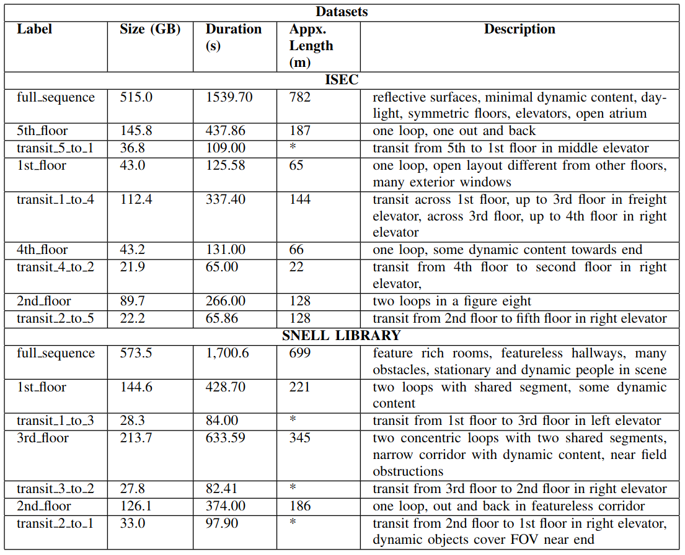

# Challenges of Indoor SLAM: A multi-modal multi-floor dataset for SLAM evaluation

<b>Abstract:</b> Robustness in Simultaneous Localization and Mapping (SLAM) remains one of the key challenges for the real-world deployment of autonomous systems. SLAM research has seen significant progress in the last two and a half decades, yet many state-of-the-art (SOTA) algorithms still struggle to perform reliably in real-world environments. There is a general consensus in the research community that we need challenging real-world scenarios which bring out different failure modes in sensing modalities. In this paper, we present a novel multi-modal indoor SLAM dataset covering challenging common scenarios that a robot will encounter and should be robust to. Our data was collected with a mobile robotics platform across multiple floors at Northeastern University's ISEC building. Such a multi-floor sequence is typical of commercial office spaces characterized by symmetry across floors and, thus, is prone to perceptual aliasing due to similar floor layouts. The sensor suite comprises seven global shutter cameras, a high-grade MEMS inertial measurement unit (IMU), a ZED stereo camera, and a 128-channel high-resolution lidar. Along with the dataset, we benchmark several SLAM algorithms and highlight the problems faced during the runs, such as perceptual aliasing, visual degradation, and trajectory drift. The benchmarking results indicate that parts of the dataset work well with some algorithms, while other data sections are challenging for even the best SOTA algorithms.

The dataset is available at the following [link](https://drive.google.com/drive/u/0/folders/1pLYTbjHxf9Q_S2exgxMLeT770NQDUMmA)

Top view of the sensor rig showing sensor frames for the front-facing camera array (red), the non-overlapping side cameras (orange), the IMU (green) and the lidar (blue). Note the above image follows the convention that $\otimes$ indicates an axis into the plane of the image, and $\bullet$ indicates an axis out of the plane of the image. All of the cameras are z-axis forward, y-axis down.

Dscription of various sensors and their settings used to collect
our dataset. Note that Zed2i sensor is available only in the Snell dataset.

A comprehensive list of all the sequences in our dataset and their description. Trajectory lengths are approximate and should only be used for qualitative comparison. They were derived from the best available trajectory estimate for each segment. This was typically lidar odometry (LegoLOAM) for the loop sequences and VIO (Basalt or VINS Fusion) for sequences inside elevators. See section V for more details on trajectory estimates.

ISEC dataset
| Label  | Size (GB) | Duration(s) |
| ------------- | ------------- |
| [full_sequence](https://drive.google.com/drive/folders/1Ga-fHoi3LFw0a25dUwJsKGJ12bB-HEwp?usp=sharing) | 515.0 | 1539.70 |
| [5th_floor](https://drive.google.com/drive/folders/1bodhTBSmlg3DGN_VPqlkIyLb9d2fvvjE?usp=sharing) | 145.8 | 437.86 |
| [transit_5_to_1](https://drive.google.com/drive/folders/1iHA91S_R2d6du8wSw7r7V2jN0lpxVlnI?usp=share_link) | 36.8 | 109.00 |
| [1st_floor](https://drive.google.com/drive/folders/12fcjSrnav_AK1eJKcqtylvWP2Bq5m8sK?usp=share_link) | 43.0 | 125.58 |
| [transit_1_to_4](https://drive.google.com/drive/folders/1i32k5xSu41RaxCGgNXbSMPNWxNdU6wok?usp=share_link) | 112.4 | 337.40 |
| [4th_floor](https://drive.google.com/drive/folders/1boNtQkpxRmYPAkKPyBxn6hZDB18TUkAy?usp=share_link) | 43.2 | 131.00 |
| [transit_4_to_2](https://drive.google.com/drive/folders/1oLeKG4bxgCQEu3twBVvBLoK8ZHUNVqnQ?usp=share_link) | 21.9 | 65.00 |
| [2nd_floor](https://drive.google.com/drive/folders/1_qwDXHqz1OtYBfuX4VuxXUc-JytevAbD?usp=share_link) | 89.7 | 266.00 |
| [transit_2_to_5](https://drive.google.com/drive/folders/1E5vQF8ZI2Y8y2u3rlTdDXqgphw5mgj8u?usp=share_link) | 22.2 | 65.86 |

<!-- 

  

 -->

