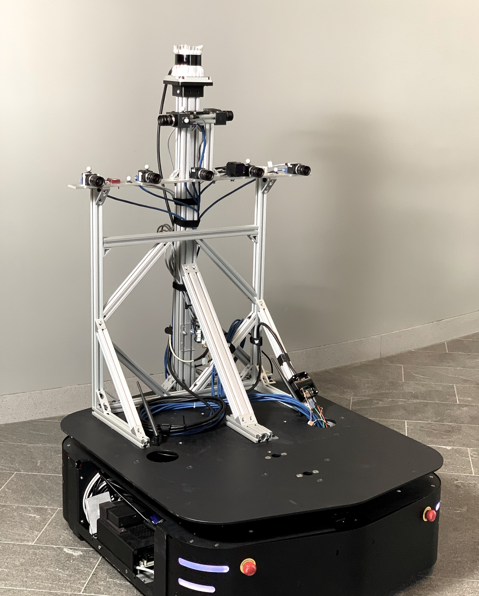
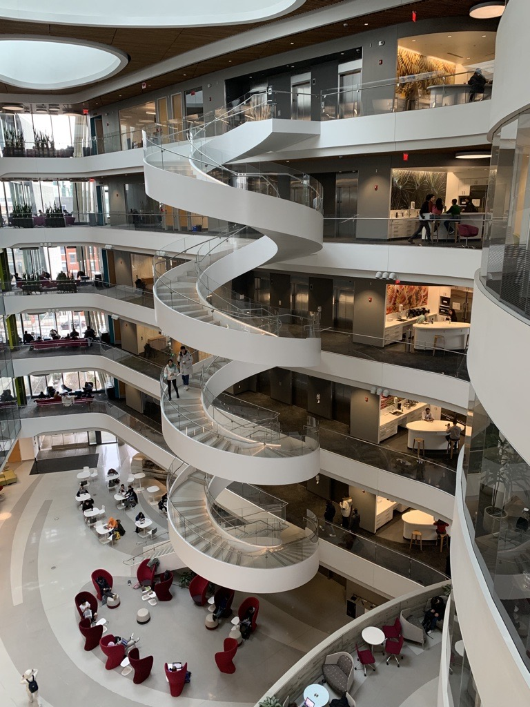
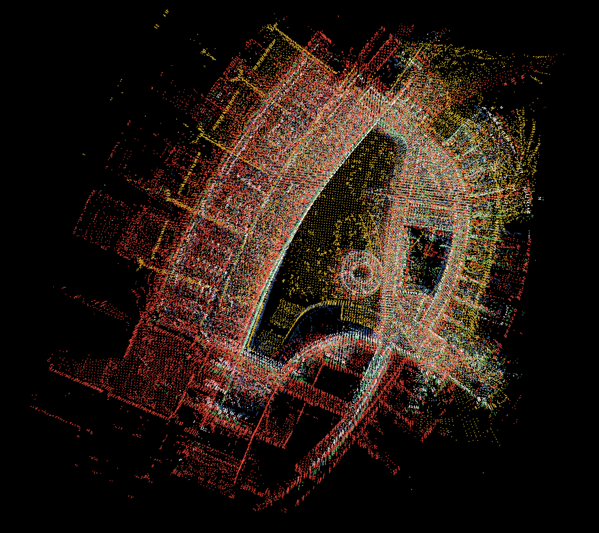
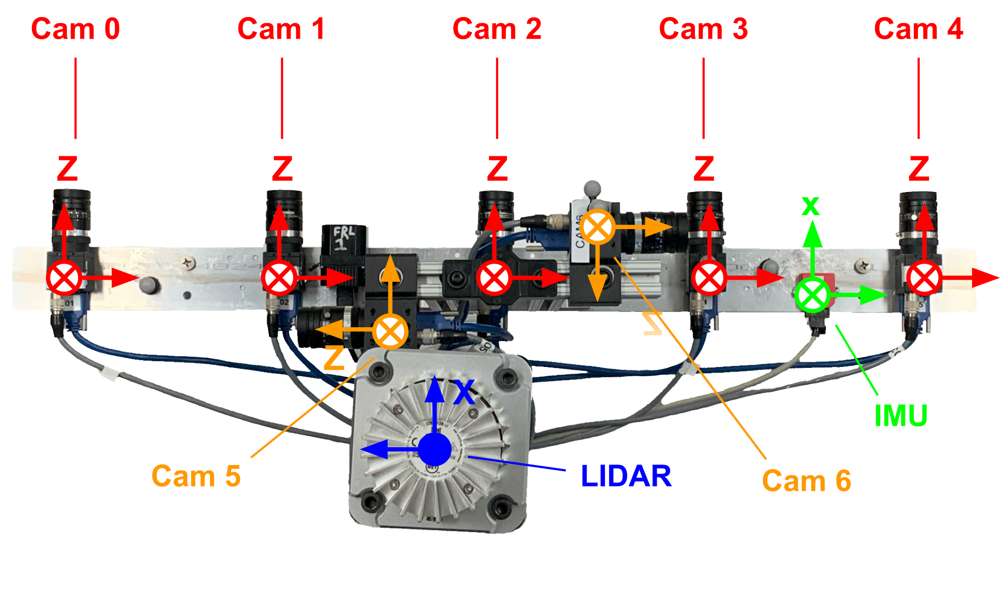
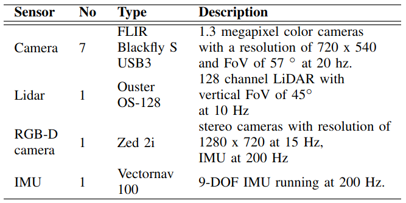

# Challenges of Indoor SLAM: A multi-modal multi-floor dataset for SLAM evaluation

<table align="center">
  <tr>
    <td> 
      
    </td>
    <td> 
      
    </td>
  </tr>
  <tr>
    <td colspan="2"> 
      
    </td>
  </tr>
</table>

<b>Abstract:</b> Robustness in Simultaneous Localization and Mapping (SLAM) remains one of the key challenges for the real-world deployment of autonomous systems. SLAM research has seen significant progress in the last two and a half decades, yet many state-of-the-art (SOTA) algorithms still struggle to perform reliably in real-world environments. There is a general consensus in the research community that we need challenging real-world scenarios which bring out different failure modes in sensing modalities. In this paper, we present a novel multi-modal indoor SLAM dataset covering challenging common scenarios that a robot will encounter and should be robust to. Our data was collected with a mobile robotics platform across multiple floors at Northeastern University's ISEC building. Such a multi-floor sequence is typical of commercial office spaces characterized by symmetry across floors and, thus, is prone to perceptual aliasing due to similar floor layouts. The sensor suite comprises seven global shutter cameras, a high-grade MEMS inertial measurement unit (IMU), a ZED stereo camera, and a 128-channel high-resolution lidar. Along with the dataset, we benchmark several SLAM algorithms and highlight the problems faced during the runs, such as perceptual aliasing, visual degradation, and trajectory drift. The benchmarking results indicate that parts of the dataset work well with some algorithms, while other data sections are challenging for even the best SOTA algorithms.

The dataset is available at the following [link](https://drive.google.com/drive/u/0/folders/1pLYTbjHxf9Q_S2exgxMLeT770NQDUMmA)

## Downloads
### ISEC dataset
| Label  | Size (GB) | Duration (s) | Appx. Length (m) | Description |
| ------------- | ------------- | ------------- | ------------- | ------------- |
| [full_sequence](https://drive.google.com/drive/folders/1Ga-fHoi3LFw0a25dUwJsKGJ12bB-HEwp?usp=sharing) | 515.0 | 1539.70 | 782 | reflective surfaces, minimal dynamic content, daylight, symmetric floors, elevators, open atrium |
| [5th_floor](https://drive.google.com/drive/folders/1bodhTBSmlg3DGN_VPqlkIyLb9d2fvvjE?usp=sharing) | 145.8 | 437.86 | 187 | one loop, one out and back |
| [transit_5_to_1](https://drive.google.com/drive/folders/1iHA91S_R2d6du8wSw7r7V2jN0lpxVlnI?usp=share_link) | 36.8 | 109.00 | N/A | transit from 5th to 1st floor in middle elevator |
| [1st_floor](https://drive.google.com/drive/folders/12fcjSrnav_AK1eJKcqtylvWP2Bq5m8sK?usp=share_link) | 43.0 | 125.58 | 65 | one loop, open layout different from other floors, many exterior windows |
| [transit_1_to_4](https://drive.google.com/drive/folders/1i32k5xSu41RaxCGgNXbSMPNWxNdU6wok?usp=share_link) | 112.4 | 337.40 | 144 | transit across 1st floor, up to 3rd floor in freight elevator, across 3rd floor, up to 4th floor in right elevator |
| [4th_floor](https://drive.google.com/drive/folders/1boNtQkpxRmYPAkKPyBxn6hZDB18TUkAy?usp=share_link) | 43.2 | 131.00 | 66 | one loop, some dynamic content towards end |
| [transit_4_to_2](https://drive.google.com/drive/folders/1oLeKG4bxgCQEu3twBVvBLoK8ZHUNVqnQ?usp=share_link) | 21.9 | 65.00 | 22 | transit from 4th floor to second floor in right elevator |
| [2nd_floor](https://drive.google.com/drive/folders/1_qwDXHqz1OtYBfuX4VuxXUc-JytevAbD?usp=share_link) | 89.7 | 266.00 | 128 | two loops in a figure eight |
| [transit_2_to_5](https://drive.google.com/drive/folders/1E5vQF8ZI2Y8y2u3rlTdDXqgphw5mgj8u?usp=share_link) | 22.2 | 65.86 | 128 | transit from 2nd floor to fifth floor in right elevator |

### ISEC dataset calibration
[Front cameras calibration](https://drive.google.com/file/d/1lxLkwcEMKf5TeIiJWZ2X6-NtqaPyxaO-/view?usp=share_link)
[Front camera_2 to IMU calibration](https://drive.google.com/file/d/1OkmgSuuP0SIqZA20dMNP2pWIjLqgDBre/view?usp=share_link)
[IMU parameters](https://drive.google.com/file/d/1EOVYdOzPHtPbLP-UCKShVpp_N6YuehTd/view?usp=share_link)

### Snell library dataset
| Label  | Size (GB) | Duration (s) | Appx. Length (m) | Description |
| ------------- | ------------- | ------------- | ------------- | ------------- |
| [full_sequence](https://drive.google.com/drive/folders/1XlQYS91HB1Qx1WoiuLxem5DEurWXezpT?usp=share_link) | 573.5 | 1,700.6 | 699 | feature rich rooms, featureless hallways, many obstacles, stationary and dynamic people in scene |
| [1st_floor](https://drive.google.com/drive/folders/1cHyJu-8BeTQcATcHj5GXpW3iNqHidvCj?usp=share_link) | 144.6 | 428.70 | 221 | two loops with shared segment, some dynamic content |
| [transit_1_to_3](https://drive.google.com/drive/folders/1jwLwl_Y0f1bEuNEO_T7FxLNf95PPvAnS?usp=share_link) | 28.3 | 84.00 | N/A | transit from 1st floor to 3rd floor in left elevator |
| [3rd_floor](https://drive.google.com/drive/folders/1zuVoPOvdKbsc26AqG_ecfEkGGVv8M_kP?usp=share_link) | 213.7 | 633.59 | 345 | two concentric loops with two shared segments, narrow corridor with dynamic content, near field obstructions |
| [transit_3_to_2](https://drive.google.com/drive/folders/1GstzwQOmjdx08IFZ6xrQJyPcRtCouNMQ?usp=share_link) | 27.8 | 82.41 | N/A | transit from 3rd floor to 2nd floor in right elevator |
| [2nd_floor](https://drive.google.com/drive/folders/11gy9NmFJeSz-bZi5RyosAuZbVIX1PTex?usp=share_link) | 126.1 | 374.00 | 186 | one loop, out and back in featureless corridor |
| [transit_2_to_1](https://drive.google.com/drive/folders/1zYIuXPg_SqJriymxaWMmFb9yzB0hN9ns?usp=share_link) | 33.0 | 97.90 | N/A | transit from 2nd floor to 1st floor in right elevator, dynamic objects cover FOV near end |

## Sensors
### Sensor rig

Top view of the sensor rig showing sensor frames for the front-facing camera array (red), the non-overlapping side cameras (orange), the IMU (green) and the lidar (blue). Note the above image follows the convention that $\otimes$ indicates an axis into the plane of the image, and $\bullet$ indicates an axis out of the plane of the image. All of the cameras are z-axis forward, y-axis down.

### Sensor setup

Dscription of various sensors and their settings used to collect
our dataset. Note that Zed2i sensor is available only in the Snell dataset.

### Citation

